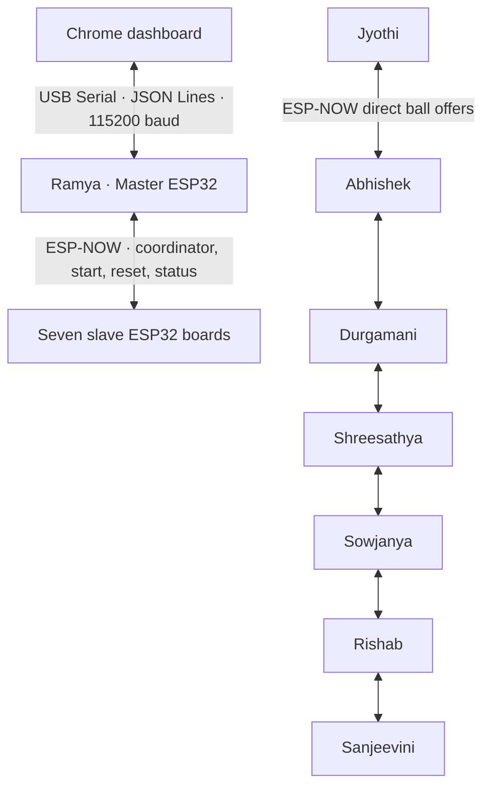
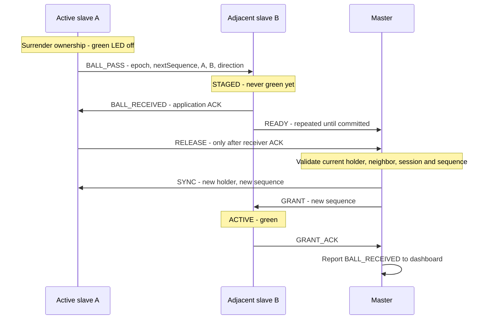

# Relay — ESP32 Virtual Ball Passing
<p align="center">
  <strong>Eight ESP32 boards. One virtual ball. Zero Wi-Fi access points.</strong><br>
  A classroom-ready ESP-NOW game with a live browser dashboard and safety-first handoffs.
</p>

<p align="center">
  
  
  
  
</p>

### ✨ At a glance

| 👥 Players | 📡 Network | 🖥️ Dashboard | 🧩 Setup |
|:--:|:--:|:--:|:--:|
| 1 Master + 7 slaves | Direct ESP-NOW | Offline HTML app | Same firmware on every board |

**Quick start:** wire the boards using [H · Wiring](#h-wiring), flash them using [I · Installation and flashing](#i-installation-and-flashing), open `dashboard/index.html`, connect the Master, wait for all seven reset acknowledgements, choose a starting player, and select **Start game**.

<details>
<summary>🧭 Jump to a section</summary>

- [A · Architecture](#a-architecture)
- [B · Folder structure](#b-folder-structure)
- [C · Communication protocol](#c-communication-protocol)
- [D · Player configuration](#d-player-configuration)
- [E · Master firmware](#e-master-firmware)
- [F · Slave firmware](#f-slave-firmware)
- [G · Dashboard](#g-dashboard)
- [H · Wiring](#h-wiring)
- [I · Installation and flashing](#i-installation-and-flashing)
- [J · Testing](#j-testing)
- [K · Troubleshooting](#k-troubleshooting)

</details>

---

Relay is an eight-board ESP-NOW project with real ESP32 firmware, an offline HTML/CSS/JavaScript dashboard, native fault tests, and full setup instructions. Flash the **same firmware to all eight boards**; each board's station MAC selects its Master or slave role.

## A. Architecture



The Master can start with any slave and remains the ownership coordinator throughout the game. Slaves exchange the actual `BALL_PASS` and receipt packets directly with immediate neighbors. The Master grants activation after both participants confirm a transfer. Every slave needs radio range to the Master and its physical neighbors. No access point, internet connection, IP networking, or backend participates in the game.

**Explicit assumptions and choices:**

- Defaults target classic **ESP32-WROOM / ESP32 DevKit / ESP32 Dev Module**, external common-cathode RGB LEDs, and 3.3 V analog joysticks. Hardware values live in `config.h`.
- The checked-in addresses are **sample placeholders**, not your boards' MACs. Replace them in `config/players.json` with the Wi-Fi station MACs before flashing, then regenerate the firmware and dashboard tables. Unknown boards report `UNKNOWN` and never initialize game participation.
- All seven slaves are required for the boot/reset safety barrier and for starting. A disconnected board can block reset completion; it cannot safely be skipped if it might still own an old ball.
- A reset clears game ID, holder, sequence, pending transfers, and LEDs. A separate persisted **epoch** remains as a stale-packet rejection fence. The dashboard reports game ID zero while idle/resetting.
- A timeout pauses a transaction. **Retry** repeats it; it never creates a replacement ball. The previous owner does not reactivate on timeout. Temporary absence of an active player is safer than two owners.
- A board restart ends the old session through a full reset barrier. The system does not attempt to resume an uncertain pre-restart ball. Master disconnect from the browser alone does not stop ESP-NOW gameplay; opening the USB port may reset some boards through their USB circuitry, which triggers the barrier.
- Registered devices are trusted participants. MAC validation and CRC detect misaddressed/corrupt frames; they are not cryptographic authentication. This implementation uses unencrypted ESP-NOW unicast for a local classroom game.
- Persistent counters must not be erased or rolled back on one board in a live installation. See K for coordinated reprovisioning.

**State machine**

| Device | State | Meaning |
|---|---|---|
| Master | RESETTING | New epoch persisted; waiting for seven reset ACKs |
| Master | IDLE | Barrier complete; may select initial slave |
| Master | GRANTING | A single recipient is designated; activation ACK pending |
| Master | ACTIVE | Current holder confirmed |
| Master | PASSING | Receiver readiness and sender release being collected |
| Slave | WAITING | No local ball; joystick ignored |
| Slave | ACTIVE | Green LED; one centered joystick gesture permitted |
| Slave | PASSING | Ball surrendered locally; offer/release being retried |
| Slave | STAGED | Offer received; waiting for Master's activation grant |
| Both | pending state + paused | Retries exhausted; recover the same transaction or reset |
| Both | ERROR + fatal | Persistent storage failed; no new ownership allowed |

The portable state machine is the same C++ code used by the firmware and the native tests.

## B. Folder structure

```text
ESP Project/
├── README.md
├── platformio.ini
├── config/players.json            # Single source of player/neighbor configuration
├── firmware/VirtualBall/
│   ├── VirtualBall.ino            # Hardware setup, serial gateway, loop
│   ├── config.h                   # Pins, timing, joystick thresholds, fault injection
│   ├── players.h                  # Generated player table and neighbor helpers
│   ├── protocol.h / protocol.cpp  # Versioned wire encoding, decoding, CRC
│   ├── game.h / game.cpp          # Master + slave state machines
│   ├── radio.h / radio.cpp        # ESP-NOW peers, queues, callbacks
│   ├── joystick.h                 # Debounced, centered, one-shot gestures
│   └── led.h                      # Replaceable setLEDColor implementation
├── dashboard/
│   ├── index.html
│   ├── style.css
│   ├── app.js                     # Player cards, controls, telemetry, event log
│   ├── serial.js                  # Streaming JSON Lines + serial lifecycle
│   └── players.js                 # Generated initial browser configuration
├── scripts/
│   ├── generate_players.py
│   └── test.ps1
├── tests/
│   ├── game_test.cpp
│   ├── serial_test.js
│   └── browser_test.py
└── docs/
    ├── TESTING.md
    └── VERIFICATION.md
```

PlatformIO builds the Arduino sketch folder directly. Arduino IDE opens `VirtualBall.ino`; all its neighboring `.cpp` and `.h` files remain in that folder. There are no separate role-specific builds that could be flashed to the wrong player.

## C. Communication protocol

**Ownership handoff**



`READY` and `RELEASE` can arrive in either order. Missing messages are retried. Duplicate packets repeat the acknowledgement without repeating activation. A slave records the sequence it surrendered, so a delayed grant cannot turn its old ball back on. `SYNC` updates knowledge and retires old transactions but **cannot activate a player**.

For the first ball the Master sends `BALL_START` to the chosen slave, then waits for `GRANT_ACK`. Each reset advances a persisted Master epoch and obtains `RESET_ACK` from all seven slaves before allowing a start. A recipient boot counter prevents a queued packet for a previous boot from being accepted after reboot. Slaves persist their last epoch before acknowledging a newer reset. Counter persistence is only on boots/resets, not on each pass.

**36-byte wire format**, explicitly encoded little-endian, no C++ struct padding:

| Bytes | Field |
|---|---|
| 0–1 | Magic `VB` |
| 2 | Version `1` |
| 3 | Message type |
| 4–5 | Actual sender and addressed recipient player IDs |
| 6–7 | Transaction origin and ball target IDs |
| 8 | Direction: `-1`, `0`, `+1` |
| 9–11 | Reserved; must be zero |
| 12–15 | Session epoch |
| 16–19 | Sequence (initial grant 1; each pass increments) |
| 20–23 | Sender's persistent boot counter |
| 24–27 | Recipient's boot counter |
| 28–31 | Message-specific value |
| 32–35 | IEEE CRC-32 of bytes 0–31 |

IDs resolve to MACs through `players[]`; the receive callback checks the actual radio source MAC against the claimed sender. Unicast destination, payload recipient, length, magic, version, CRC, IDs, type, boot, epoch, sequence, role, and route are checked at the transport/state-machine layers. `HELLO` is the only discovery packet exempt from the recipient boot check; it cannot activate a ball.

| Number | Type | Purpose |
|---|---|---|
| 1 | HELLO | Discover sender boot identity; periodic reachability |
| 2 / 3 | RESET / RESET_ACK | Clear state and complete reset barrier |
| 4 | BALL_START | Master grants initial ball |
| 5 / 6 | BALL_PASS / BALL_RECEIVED | Direct neighboring offer and application ACK |
| 7 / 8 | READY / RELEASE | Receiver staging and sender surrender confirmed to Master |
| 9 / 10 | GRANT / GRANT_ACK | Activate one new holder and acknowledge |
| 11 | SYNC | Read-only holder/sequence knowledge; retire old transactions |
| 12 | HEARTBEAT | Local state for dashboard |
| 13 | RETRY | Resume the same pending transaction |
| 14 | FAULT | Joystick/invalid-direction report |
| 15 | DIRECTORY | Master supplies neighboring boot identities |

Default timeout: **350 ms**, initial attempt + **5 retries** per burst. A pending timeout sets `paused` and logs an error. Master recovery retries notify involved slaves. Discovery/reset repair can also resume when a previously missing slave announces itself. Heartbeats occur every approximately **2 seconds**, staggered by player ID. Devices are offline after **7 seconds** without a validated message. ESP-NOW callbacks only copy into queues; application processing and JSON output happen in `loop()`.

An ESP-NOW send return/callback is only transport telemetry, never proof of game delivery. Espressif recommends application acknowledgements, sequence numbers, and short callbacks: [official ESP-NOW reference](https://docs.espressif.com/projects/esp-idf/en/v4.4.7/esp32/api-reference/network/esp_now.html).

**USB serial protocol:** UTF-8 JSON objects, one per newline, 115200 baud. Commands may also be pasted into Serial Monitor with newline enabled.

```json
{"type":"GET_CONFIG"}
{"type":"GET_STATUS"}
{"type":"START_GAME","player":4}
{"type":"RESET_GAME"}
{"type":"RETRY"}
```

`START_GAME` is accepted only when idle and all slaves are online; reset an existing game before starting another. The browser sends player IDs, never MACs or permissions. Example event:

```json
{"type":"BALL_RECEIVED","message":"Ball activation acknowledged","from":3,"to":4,"uptimeMs":12345,"gameId":12,"sequence":3}
```

`CONFIG` supplies actual firmware names, addresses, roles, neighbors and channel. `GAME_STATE` includes holder/previous/target, state, epoch, game ID, sequence, paused flag, ESP-NOW status, counters, packet/ACK timestamps, and per-player online/state/reset status. Firmware emits a snapshot every second and on request. The browser requests a snapshot immediately on transfer events. Timestamps are Master uptime, while the event log displays browser reception time. Firmware accepts lines up to 384 bytes; oversized lines are discarded through the next newline. The browser caps incoming lines at 16 KiB, tolerates partial/multiple lines, and ignores boot chatter.

## D. Player configuration

| ID | Name | Role | Sample MAC | Left | Right |
|---|---|---|---|---|---|
| 1 | Ramya G | MASTER | `02:00:00:00:00:01` | - | - |
| 2 | Jyothi.K | SLAVE | `02:00:00:00:00:02` | - | 3 |
| 3 | ABHISHEK KUMAR | SLAVE | `02:00:00:00:00:03` | 2 | 4 |
| 4 | Durgamani R | SLAVE | `02:00:00:00:00:04` | 3 | 5 |
| 5 | Shreesathya | SLAVE | `02:00:00:00:00:05` | 4 | 6 |
| 6 | Sowjanya N | SLAVE | `02:00:00:00:00:06` | 5 | 7 |
| 7 | Rishab Kumar Kannaujia | SLAVE | `02:00:00:00:00:07` | 6 | 8 |
| 8 | Sanjeevini | SLAVE | `02:00:00:00:00:08` | 7 | - |

Edit `config/players.json`, then run `python scripts/generate_players.py`. It validates unique MACs, reciprocal links, and a single connected chain, and generates `players.h` and `players.js`. The generated files contain the same names and MAC addresses. The checked-in MACs are placeholders; replace them with your own before flashing. Keep IDs 1–8 and Master ID 1; reorder players by changing links, not game logic. Regenerate and flash all boards after topology changes. Browser configuration is refreshed from the connected Master.

## E. Master firmware

Implemented in `VirtualBall.ino` plus the Master branches of `game.cpp`. At boot it reads the station MAC, identifies Ramya, persists its boot counter and a new session epoch, registers all seven peers, then begins the reset barrier. It accepts dashboard commands, enforces all routes itself, coordinates transfers, and reports radio and game errors. No joystick is needed on the Master. Its RGB LED indicates resets/pending failures; it never holds the slave ball.

## F. Slave firmware

The same sketch selects the slave role automatically from its MAC. It initializes an ADC1 joystick and RGB LED, announces its boot counter, waits for the Master's reset handshake, and accepts initial grants only from the Master. It accepts neighbor offers only from the configured adjacent slave with a valid direction. Only a Master grant can turn it green.

Joystick behavior: both axes must return to the configurable center window for 65 ms after gaining the ball. A sustained horizontal gesture beyond the deadzone for 65 ms creates one pass. Holding the stick cannot repeat it; moving while inactive cannot pre-arm it. Up/down gestures are ignored. The switch is configured with a pull-up but reserved for future use. Rail input lasting 15 seconds reports a wiring/held-stick warning; this cannot reliably detect every disconnected analog input.

LED output is deliberately isolated in `led.h`. The default uses three digital channels: green active, blue blinking while passing/staged/resetting, red blinking after ACK timeout, red steady on fatal initialization/storage failure, and off while waiting. No addressable LED library is required. Replace `setLEDColor()` and `beginLED()` to support another indicator.

## G. Dashboard

Open **`dashboard/index.html`** in desktop Chrome or Edge. It contains no CDN, external fonts, application backend, frontend build step, or framework. All eight cards display name, ID, role, MAC, availability, reported state, and ball indication. The Master is separate above a continuous vertical slave chain. **Top/up corresponds to joystick LEFT; bottom/down corresponds to RIGHT**, as configured in the table. Neighbor arrows visibly connect each pair.

Controls: Connect/Disconnect Master, select starting player, Start game, Reset game, Retry transfer, and Clear log. The dashboard highlights only a confirmed, online holder in green. Pending/uncertain ownership is shown explicitly. A missing status stream disables controls after 4.5 seconds and removes confirmed highlights; physical devices may still be playing. Offline cards show the last known state without claiming live ownership. Closing the browser does not issue a game reset.

Web Serial needs a supported desktop browser, a secure context, and the user clicking Connect to choose the USB port. Close Arduino Serial Monitor and other serial tools first. The official browser API and reader/writer lifecycle are documented in [Chrome's Web Serial guide](https://developer.chrome.com/docs/capabilities/serial). If your browser's local-file policy blocks access, use the optional static-file fallback in I. This is only a file server, not a game backend.

## H. Wiring

Repeat this joystick wiring on **all seven slaves**; the Master only needs USB and its RGB LED.

| Component signal | Classic ESP32 pin | Notes |
|---|---|---|
| Joystick VCC / + | 3V3 | Power at 3.3 V, never feed 5 V analog signals into ESP32 |
| Joystick GND | GND | Common ground with that board |
| Joystick VRx | GPIO34 | ADC1, input-only |
| Joystick VRy | GPIO35 | ADC1, input-only |
| Joystick SW | GPIO32 | Optional; internal pull-up, switch closes to ground |
| RGB LED red anode | GPIO25 **through 330 Ω resistor** | One resistor for this color |
| RGB LED green anode | GPIO26 **through 330 Ω resistor** | One resistor for this color |
| RGB LED blue anode | GPIO27 **through 330 Ω resistor** | One resistor for this color |
| RGB common cathode | GND | Default LED type |
| Master USB | Computer | Data-capable USB cable |
| Slave USB / supply | Suitable regulated board supply | Power each board; no data cable needed during play |

```text
ESP32 GPIO25 ── 330 Ω ── R anode ┐
ESP32 GPIO26 ── 330 Ω ── G anode ├── RGB common cathode ── GND
ESP32 GPIO27 ── 330 Ω ── B anode ┘

ESP32 3V3 ── joystick VCC      VRx ── GPIO34
ESP32 GND ── joystick GND      VRy ── GPIO35
                              SW  ── GPIO32 (optional)
```

For a common-anode RGB LED, connect its common pin to **3V3** and set `COMMON_ANODE=true`; retain one resistor per channel. Check your LED's pinout rather than assuming pin order. Simple RGB LEDs are different from WS2812/NeoPixel modules.

GPIO34/35 are ADC1 inputs on the classic ESP32; ADC2 has Wi-Fi access restrictions on this variant. See [Espressif ADC documentation](https://docs.espressif.com/projects/esp-idf/en/v4.4.7/esp32/api-reference/peripherals/adc.html). The defaults avoid classic boot strapping and flash pins. On S2/S3/C3 boards, change the PlatformIO board target and all pins to valid ADC1/output pins for that board, review USB behavior, then compile/test again. Those variants are not the verified default target.

`config.h` centralizes pins, common-anode/inversion choices, ADC center, deadzone (900), neutral window (350), debounce (65 ms), sample period (10 ms), channel (1), ACK timeout/retries, heartbeat/offline interval, and serial baud. If the physical joystick left/right is reversed, set `INVERT_X=true`. For atypical centers, measure neutral ADC values and adjust `ADC_CENTER`/`CENTER_ZONE`. All boards must share the same radio channel and protocol/timing configuration. If changing serial baud, also change `SerialLink.connect()` in `dashboard/serial.js` and `monitor_speed` in `platformio.ini`.

## I. Installation and flashing

### PlatformIO (recommended reproducible build)

Install Python and PlatformIO Core or the PlatformIO extension in VS Code. The project pins **Espressif32 platform 6.9.0 / Arduino-ESP32 2.0.17**, and **ArduinoJson 6.21.5**. Do not upgrade the Arduino core to 3.x without porting the ESP-NOW callback signatures; the project rejects that build explicitly.

In the project directory:

```powershell
python -m pip install platformio==6.1.18
python scripts/generate_players.py
python -m platformio run
python -m platformio device list
python -m platformio run --target upload --upload-port COM5
python -m platformio device monitor --port COM5 --baud 115200
```

Replace `COM5` with the connected board's actual port. Flash each of the eight devices. If automatic upload fails, hold **BOOT** while upload connects, then release it. Use a data-capable cable and the USB bridge driver appropriate to the board. Monitor boot JSON to verify the device's MAC, name, role, and left/right neighbors. Exit the monitor before using the dashboard.

PlatformIO's [`esp32dev` board definition](https://docs.platformio.org/en/latest/boards/espressif32/esp32dev.html) targets the standard Espressif ESP32 Dev Module. Firmware output is `.pio/build/esp32dev/firmware.bin`; normal upload also installs the matching bootloader and partition table.

### Arduino IDE alternative

1. Add Espressif's stable board manager URL from the [official installation guide](https://docs.espressif.com/projects/arduino-esp32/en/latest/installing.html): `https://espressif.github.io/arduino-esp32/package_esp32_index.json`.
2. Install **esp32 by Espressif Systems, version 2.0.17**, through Boards Manager.
3. Install **ArduinoJson by Benoit Blanchon, version 6.21.5**, through Library Manager.
4. Open `firmware/VirtualBall/VirtualBall.ino`. Keep all supplied `.h` and `.cpp` files beside it.
5. Select **ESP32 Dev Module**, the correct port, and a partition with at least 1.3 MB application space (the default configuration is sufficient).
6. Verify and upload the same sketch to every board. Use Serial Monitor at 115200 with newline enabled to check identity.

### Run the game

1. Place slaves in the configured chain; power all eight boards. Center all joysticks.
2. Connect Ramya's board to the computer and close serial monitors.
3. Open `dashboard/index.html` in desktop Chrome. Click **Connect Master**, then choose the Master USB port.
4. Wait for **8 / 8 online** and **Ready to start**. Reset ACKs are shown if any board is missing.
5. Select **Durgamani R · Player 4** and press **Start game**. Only Durgamani should be green.
6. Move Durgamani's stick left once: Abhishek becomes green. Center Abhishek's stick and move right: Durgamani becomes green again.
7. Use **Reset game** to stop; wait for all slaves to clear. Select another first player and start again.

Optional localhost fallback if local-file Web Serial is blocked:

```powershell
python -m http.server 8000 --bind 127.0.0.1 --directory dashboard
```

Open `http://localhost:8000`. There is no server-side game logic.

## J. Testing

Run the automated native and serial tests on Windows with Python, a C++11 compiler (`g++`), and Node available for **development testing only**:

```powershell
powershell -ExecutionPolicy Bypass -File scripts/test.ps1
```

The delivered browser application does not need Node. Browser integration tests additionally use Python Playwright with locally installed Chrome; see `tests/browser_test.py`.

See [the complete hardware test plan](docs/TESTING.md) for all fifteen requested cases plus reboot, reset partitions, stale packets, and browser lifecycle tests. See [verification results](docs/VERIFICATION.md) for the distinction between automated checks and hardware validation still to perform.

## K. Troubleshooting

| Symptom | Action |
|---|---|
| `UNKNOWN MAC` | Read the printed station MAC; check the supplied addresses, not Bluetooth/SoftAP MACs. Correct `players.json`, regenerate, and reflash every board. Do not spoof a second board's MAC. |
| ESP-NOW initialization/peer failure | Check pinned core, available memory, all channel settings, and the board definition. Reboot after correcting settings. Participation remains disabled on initialization failure. |
| Reset stays pending | Power every configured slave; confirm identity and common channel. Bring it near the Master. Reset cannot finish while an old owner might be unreachable. |
| Red blinking / ACK timeout | Restore radio range or power, then **Retry transfer**. If a board rebooted, the Master starts a full reset. Avoid starting a replacement ball manually. |
| Green board goes offline | Dashboard removes confirmed ownership; the physical board may still be green. Reconnect it, then retry/reset. Offline is a telemetry condition, not permission to reassign its ball. |
| No joystick pass | Confirm this is the green player. Center both axes for at least 65 ms, then move horizontally beyond the deadzone. Check ADC1 wiring, center thresholds, and 3.3 V supply. |
| Wrong left/right direction | Set `INVERT_X` in `config.h`; verify `left`/`right` links in central configuration. |
| Held stick reports rail error | Recenter. If warnings persist at rest, inspect VRx/VRy/VCC/GND and analog readings. Floating inputs cannot always be detected automatically. |
| RGB colors wrong | Check R/G/B wiring, separate resistors, common cathode/anode, and pin configuration. Default code does not drive WS2812 LEDs. |
| Web Serial unavailable | Use desktop Chrome/Edge. Check secure context and browser policy; use localhost fallback. Mobile Safari/Firefox are not supported by this dashboard. |
| Port busy or cannot open | Close Serial Monitor/other tabs/tools; disconnect and reconnect USB; verify USB driver and cable. |
| Dashboard says wrong board | Move the USB connection to Ramya's Master. The UI validates firmware identity before enabling controls. |
| Master status becomes stale | Check USB/cable/power. Controls disable until valid Master telemetry resumes. Reconnect without assuming the ball has disappeared. |
| NVS/epoch failure | Preserve all boards' NVS during ordinary uploads. If deliberate reinitialization is needed, power down all boards together, erase/reprovision the entire set with matching firmware, and begin with a fresh all-board reset. Never roll one counter back in a live game. |
| Core 3.x compile error | Install the pinned 2.0.17 core or use the pinned PlatformIO environment. ESP-NOW callback signatures differ across core generations. |

Safety is conditional on correct firmware, retained monotonic NVS counters, unique configured MACs, and trusted devices. A permanently failed/unreachable owner cannot be both safely replaced and guaranteed cleared over a lossy radio link. This implementation preserves the single-owner rule by waiting for recovery/reset acknowledgements rather than claiming that limitation is solvable with a timeout.


